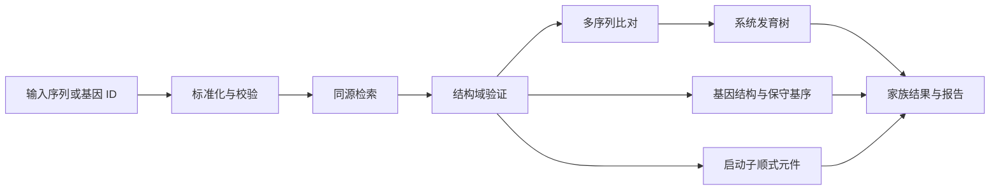

# Gene Family MCP

面向 AI Agent 的基因家族分析 MCP。仓库明确分成两个独立运行单元：

```text
MCP Client  <──stdio──>  mcp_server  <──HTTP/JSON──>  backend_service
                                                     ├── Django Ninja API
                                                     ├── django-q2 worker
                                                     ├── PlantCARE provider
                                                     └── 分析结果存储
```

当前实现首先提供 PlantCARE 启动子顺式作用元件预测，后续将逐步增加序列校验、同源检索、结构域鉴定、多序列比对、系统发育、保守基序和基因结构分析。

> 当前状态：MCP 与后端已经分层，后端具备持久化业务任务、事件、产物清单和 django-q2 ORM 队列。PlantCARE 提交与结果回收已拆成两个阶段，结果由 django-q2 Schedule 每分钟检查；完整基因家族分析工作流尚未实现。

PlantCARE 邮件附件会经过安全归档检查与结构化解析。`.tab` 结果被转换为 JSON，包含记录总数、序列计数、元件类型计数、各元件频数和完整位点记录；原始归档、HTML、TSV 与 JSON 均作为带 SHA-256 的 Artifact 保存。

## 两个服务的职责

### `mcp_server`

MCP 协议适配层，供 Codex、Claude Desktop 等 MCP 客户端连接。

它负责：

- 注册 MCP tools。
- 将工具调用转换成后端 HTTP 请求。
- 返回结构化任务状态和结果。
- 隐藏后端内部数据库、队列和 provider 实现。

它不直接访问数据库、邮箱、PlantCARE，也不执行生信程序。

当前 tools：

| Tool | 说明 |
| --- | --- |
| `backend_health` | 检查后端 API 是否可用 |
| `get_capabilities` | 查看可用分析能力与队列后端 |
| `submit_cis_element_analysis` | 提交 DNA 启动子序列分析 |
| `get_job_status` | 查询业务任务状态与阶段 |
| `get_job_result` | 获取完成任务的结构化结果和产物 |
| `cancel_job` | 取消未结束任务 |

### `backend_service`

无前端页面的 API 与任务后端。

它负责：

- Django Ninja REST API。
- 输入校验、任务创建和状态查询。
- django-q2 worker 与任务执行。
- PlantCARE HTTP 提交、IMAP 邮件回收和附件保存。
- 后续本地生信工具与分析工作流。

当前 API：

| 方法 | 路径 | 说明 |
| --- | --- | --- |
| `GET` | `/api/core/health` | 后端健康检查 |
| `GET` | `/api/core/capabilities` | 分析能力与执行后端 |
| `POST` | `/api/jobs` | 创建通用分析任务 |
| `GET` | `/api/jobs/{job_id}` | 查询业务任务 |
| `GET` | `/api/jobs/{job_id}/result` | 获取结果与产物清单 |
| `POST` | `/api/jobs/{job_id}/cancel` | 取消任务 |
| `GET` | `/api/artifacts/{artifact_id}/download` | 下载产物 |
| `POST` | `/api/cis-elements/submit` | 提交顺式作用元件分析 |
| `GET` | `/api/cis-elements/tasks/{task_id}` | 查询状态或结果 |
| `GET` | `/api/docs` | OpenAPI 文档 |

仓库不再提供 HTML 预测页面和 Django Admin 路由。

## 目录结构

```text
gene-family-mcp/
├── mcp_server/
│   ├── server.py             # MCP tools 和 stdio 入口
│   ├── backend_client.py     # 后端 HTTP client
│   ├── settings.py           # MCP 侧配置
│   └── requirements.txt
├── backend_service/
│   ├── config/               # Django 配置与 API 路由
│   ├── core/                 # 健康检查等基础 API
│   ├── cis_elements/         # PlantCARE API 与 provider 原型
│   ├── jobs/                 # 业务任务、事件、产物与 q2 worker 入口
│   ├── scripts/              # PlantCARE 独立调试脚本
│   ├── tests/fixtures/       # 测试输入
│   ├── manage.py
│   └── requirements.txt
├── docs/
│   ├── architecture.md       # 架构边界与演进方案
│   └── plantcare-cli.md      # 独立脚本使用说明
└── README.md
```

## 快速开始

### 1. 创建虚拟环境

```powershell
python -m venv venv
.\venv\Scripts\python.exe -m pip install -r .\requirements-dev.txt
```

### 2. 配置 PlantCARE 邮箱

使用邮箱 IMAP 授权码，不要使用网页登录密码：

```powershell
$env:PLANTCARE_EMAIL = "your-email@qq.com"
$env:PLANTCARE_AUTH_CODE = "your-imap-auth-code"
$env:PLANTCARE_IMAP_HOST = "imap.qq.com"
```

### 3. 启动后端 API

```powershell
Set-Location .\backend_service
..\venv\Scripts\python.exe manage.py migrate
..\venv\Scripts\python.exe manage.py runserver
```

后端默认地址为 `http://127.0.0.1:8000/api`。

### 4. 启动 worker

在第二个终端执行：

```powershell
Set-Location .\backend_service
..\venv\Scripts\python.exe manage.py qcluster
```

### 5. 启动 MCP Server

在第三个终端回到仓库根目录：

```powershell
$env:GENE_FAMILY_BACKEND_URL = "http://127.0.0.1:8000/api"
.\venv\Scripts\python.exe -m mcp_server.server
```

MCP Server 默认使用 `stdio` transport。客户端配置时，命令应指向虚拟环境 Python，参数为 `-m mcp_server.server`，工作目录为仓库根目录。

## API 示例

使用通用任务接口提交分析：

```powershell
$body = @{
  analysis_type = "cis_elements"
  parameters = @{ sequence = "ACGTACGTNNACGT" }
} | ConvertTo-Json -Depth 3
Invoke-RestMethod `
  -Method Post `
  -Uri http://127.0.0.1:8000/api/jobs `
  -ContentType application/json `
  -Body $body
```

查询状态：

```powershell
Invoke-RestMethod `
  -Uri http://127.0.0.1:8000/api/jobs/<job_id>
```

## 目标分析流程



后端负责执行和持久化这一流程；MCP 只提供稳定、面向 Agent 的工具接口。

## 下一阶段

- [x] 建立业务级 `AnalysisJob`、`Artifact` 和 `AnalysisEvent` 表。
- [x] 将 PlantCARE 长时间邮箱等待改为 django-q2 Schedule 周期检查。
- [x] 使用业务 UUID 和持久化状态解决任务查询问题。
- [ ] 为 MCP 与后端通信增加认证、稳定错误码和超时策略。
- [ ] 增加单元测试、API 集成测试和 MCP 工具测试。
- [ ] 增加 FASTA 资源上传与 artifact 下载 API。
- [x] 安全解析 PlantCARE 归档与 `.tab`，生成结构化 JSON Artifact。
- [ ] 接入 BLAST/DIAMOND、HMMER、MAFFT 和 IQ-TREE。

## 工程检查

Windows 开发环境可以运行：

```powershell
.\scripts\check.ps1
```

该命令执行 Django 系统检查、迁移漂移检查、后端测试、MCP 测试、Python 编译和 Git diff 检查。GitHub Actions 会在 push 和 pull request 时执行对应检查。

更详细的状态模型、数据模型和迁移计划见 [架构文档](docs/architecture.md)。

## 安全说明

- 不要提交邮箱授权码和 `.env`。
- MCP Server 不应接触 provider 密钥。
- 后端响应不应暴露邮箱正文、绝对路径或完整 traceback。
- 正式部署需要关闭 Django `DEBUG`、设置随机密钥并增加 API 认证。

## License

项目尚未添加开源许可证。公开发布前需要明确许可证，并核对 PlantCARE 及后续生信工具和数据库的使用条款。
