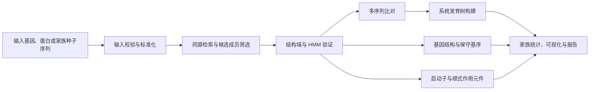
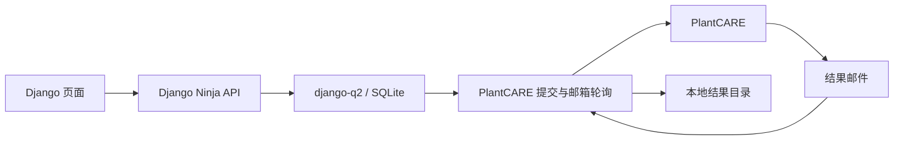
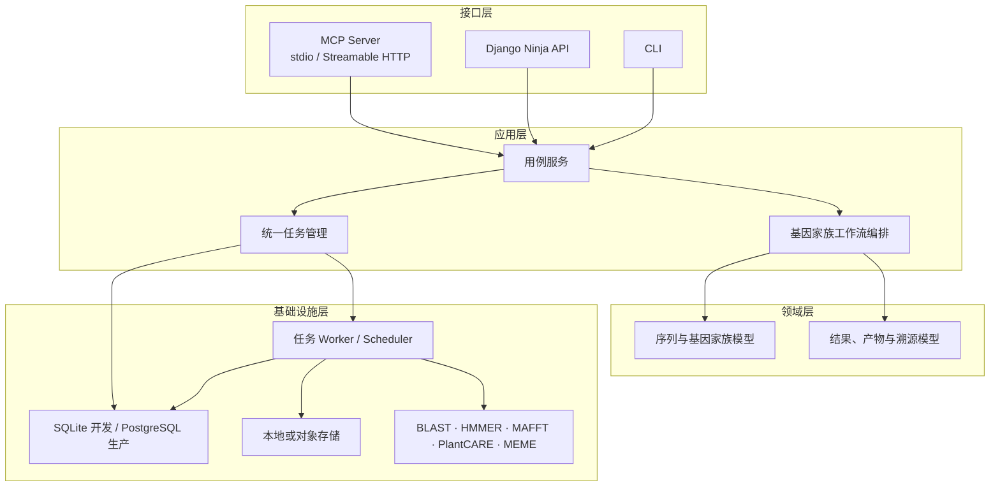

# Gene Family MCP

面向 AI Agent 的基因家族分析服务。项目目标是把序列校验、同源基因检索、结构域鉴定、多序列比对、系统发育树、基因结构、保守基序、启动子顺式作用元件和结果汇总封装为可组合、可追踪的 MCP（Model Context Protocol）工具。

> 当前状态：**架构重整阶段，尚未提供可连接的 MCP Server。** 仓库现有实现是一个 PlantCARE 顺式作用元件预测原型，包括命令行脚本、Django Ninja API、django-q2 异步任务和邮箱结果回收。它将作为未来基因家族工作流中的一个分析适配器继续演进。

## 项目目标

Gene Family MCP 不负责替 AI 做不可追溯的“黑盒结论”，而是为 Agent 提供标准化分析能力：

- 接收 FASTA、基因 ID、基因组注释或已有分析结果。
- 校验输入并记录参数、软件版本和数据来源。
- 调度本地工具或远程生物信息学服务。
- 用统一任务模型表示排队、运行、成功、失败和取消状态。
- 将表格、树文件、图片和报告作为可下载、可复用的分析产物。
- 通过 MCP tools/resources 向 Codex、Claude Desktop 等兼容客户端暴露能力。
- 同一套业务逻辑可被 MCP、HTTP API 和命令行复用。

## 计划覆盖的分析流程



建议分阶段实现，而不是一开始就把所有外部工具接入：

1. 建立 MCP Server、统一任务模型、文件产物模型和序列校验。
2. 将现有 PlantCARE 能力重构为独立 provider。
3. 增加 BLAST/HMMER、MAFFT 和系统发育树工作流。
4. 增加结构域、基因结构、MEME motif、共线性和表达分析。
5. 生成带完整溯源信息的家族分析报告。

## 当前已经具备的能力

| 能力 | 状态 | 当前入口 | 说明 |
| --- | --- | --- | --- |
| PlantCARE 表单提交 | 原型可用 | `plantcare_submit.py` | 支持序列或 FASTA 文件 |
| 邮箱轮询与附件下载 | 原型可用 | `test.py` | 通过 IMAP 匹配任务 `ref` |
| Django 健康检查 | 可用 | `GET /api/core/health` | 返回服务状态 |
| 顺式元件异步提交 | 原型 | `POST /api/cis-elements/submit` | 依赖 django-q2 和邮箱配置 |
| 任务状态查询 | 需要修复 | `GET /api/cis-elements/tasks/{task_id}` | 当前队列状态识别不可靠 |
| MCP Server | 未实现 | — | 下一阶段的首要工作 |
| 完整基因家族分析 | 未实现 | — | 按路线图逐步接入 |

## 架构重新评估

### 现有架构



这个原型验证了 PlantCARE 的调用链，但不宜直接扩展成完整 MCP：

- MCP、HTTP、任务调度和 PlantCARE 细节尚未分层。
- 一个 worker 会在 IMAP 轮询中阻塞最长 30 分钟，而队列任务超时只有 90 秒。
- 任务状态依赖 django-q2 内部序列化字段，未知任务也会被显示为 `processing`。
- 没有业务级任务表、产物表、输入溯源或结构化结果模型。
- PlantCARE 邮件附件只保存路径，尚未解析成统一结果。
- 当前没有自动化测试。

### 推荐架构：模块化单体 + 独立 worker

初期不建议拆微服务。推荐保留 Python/Django 作为控制面，但让业务能力脱离 Django view 和 django-q2 数据模型：



详细的架构问题、边界、数据模型和迁移方案见 [架构设计文档](docs/architecture.md)。

## 建议的 MCP 能力

MCP 接口应保持小而稳定，复杂工作流由服务端编排。首批建议提供：

| MCP Tool | 用途 | 同步方式 |
| --- | --- | --- |
| `validate_sequences` | 校验并标准化 DNA/CDS/蛋白 FASTA | 同步 |
| `submit_cis_element_analysis` | 提交启动子顺式作用元件分析 | 异步，返回 `job_id` |
| `submit_gene_family_analysis` | 提交组合式家族分析流程 | 异步，返回 `job_id` |
| `get_job_status` | 查询任务阶段、进度和错误 | 同步 |
| `get_job_result` | 获取结构化结果和产物清单 | 同步 |
| `cancel_job` | 取消尚未完成的任务 | 同步 |

建议提供的 MCP resources：

- `gene-family://jobs/{job_id}`：任务元数据和当前状态。
- `gene-family://jobs/{job_id}/result`：结构化结果。
- `gene-family://artifacts/{artifact_id}`：FASTA、TSV、Newick、SVG、PNG 或报告。
- `gene-family://capabilities`：已安装分析后端、版本和限制。

所有耗时工具都应立即返回 `job_id`，不应让一次 MCP 调用持续等待外部网站邮件或长时间命令执行。

## 推荐目录结构

下面是目标结构，不代表当前仓库已经完成迁移：

```text
gene-family-mcp/
├── README.md
├── pyproject.toml
├── docs/
│   └── architecture.md
├── src/gene_family_mcp/
│   ├── domain/               # 序列、任务、结果、产物等纯领域模型
│   ├── application/          # 用例服务与工作流编排
│   ├── providers/            # PlantCARE、BLAST、HMMER、MAFFT 等适配器
│   ├── jobs/                 # 队列、worker、调度和状态机
│   ├── storage/              # 数据库与产物存储
│   ├── interfaces/
│   │   ├── mcp/              # MCP tools/resources/server
│   │   ├── http/             # 可选 HTTP API
│   │   └── cli/              # 命令行入口
│   └── settings.py
├── tests/
│   ├── unit/
│   ├── integration/
│   └── fixtures/
└── legacy/                   # 迁移完成前保存现有原型入口
```

## 当前原型的本地运行

### 1. 创建环境

当前依赖文件位于 `ninja_service/requirements.txt`：

```powershell
python -m venv venv
.\venv\Scripts\python.exe -m pip install -r .\ninja_service\requirements.txt
```

### 2. 配置 PlantCARE 邮箱

应使用邮箱授权码，不要使用网页登录密码：

```powershell
$env:PLANTCARE_EMAIL = "your-email@qq.com"
$env:PLANTCARE_AUTH_CODE = "your-imap-auth-code"
$env:PLANTCARE_IMAP_HOST = "imap.qq.com"
```

不要把授权码写入源码或提交到 Git。

### 3. 初始化并启动 Django

分别打开两个终端：

```powershell
Set-Location .\ninja_service
..\venv\Scripts\python.exe manage.py migrate
..\venv\Scripts\python.exe manage.py runserver
```

```powershell
Set-Location .\ninja_service
..\venv\Scripts\python.exe manage.py qcluster
```

可访问：

- 顺式元件预测页面：`http://127.0.0.1:8000/cis-elements/`
- OpenAPI 文档：`http://127.0.0.1:8000/api/docs`
- 健康检查：`http://127.0.0.1:8000/api/core/health`

> 注意：当前队列超时和轮询模型尚未整改，Web 预测流程只适合开发验证。独立脚本用法见 [PlantCARE 使用文档](使用文档.md)。

## 配置原则

- 密钥只通过环境变量或密钥管理服务注入。
- 每个 provider 独立配置超时、重试和并发限制。
- 每次分析记录输入摘要、参数、工具版本、数据库版本和运行日志。
- 开发环境可以使用 SQLite；多 worker 或生产部署改用 PostgreSQL。
- 分析产物不要直接塞入任务表，应保存到独立 artifact store。

## 测试策略

当前测试数量为 0。重构时至少需要：

- 领域层单元测试：FASTA 解析、序列类型识别、参数校验、任务状态转换。
- provider 契约测试：用固定响应模拟 PlantCARE、BLAST/HMMER 等外部依赖。
- 任务集成测试：提交、执行、失败、超时、重试、取消和结果恢复。
- MCP 协议测试：工具 schema、错误响应、资源读取和长任务轮询。
- 安全测试：附件路径穿越、超大输入、非法字符和敏感信息泄漏。

测试不应依赖真实邮箱或真实 PlantCARE 服务；在线端到端测试应单独标记并由显式配置启用。

## 近期路线图

- [ ] 建立 `pyproject.toml`、`src/` 布局和统一配置。
- [ ] 定义 `AnalysisJob`、`Artifact`、`AnalysisEvent` 数据模型。
- [ ] 实现基础 MCP Server 和 `validate_sequences`。
- [ ] 将 PlantCARE 提交、邮件回收和结果解析拆成 provider。
- [ ] 使用调度任务检查邮箱，移除 worker 内长时间 `sleep`。
- [ ] 修复任务状态机、超时、幂等性和重试策略。
- [ ] 增加单元与集成测试。
- [ ] 接入 BLAST/HMMER、MAFFT 和系统发育树流程。
- [ ] 输出标准 TSV/JSON/Newick/图片及可复现报告。

## 设计原则

1. **可复现**：任何结论都能追溯到输入、参数、版本和产物。
2. **异步优先**：外部服务和生信工具都是任务，不阻塞 MCP 会话。
3. **接口与实现解耦**：MCP、HTTP、CLI 共用同一应用服务。
4. **provider 可替换**：远程 PlantCARE 与未来本地实现可以替换或并存。
5. **结构化结果优先**：原始文件保留，但 Agent 首先获得稳定 JSON schema。
6. **失败可诊断**：区分输入错误、依赖缺失、远程服务失败、超时和系统错误。

## License

仓库目前尚未添加开源许可证。正式公开或接受外部贡献前，应明确许可证，并核对所调用数据库、远程服务和第三方分析工具的使用条款。
