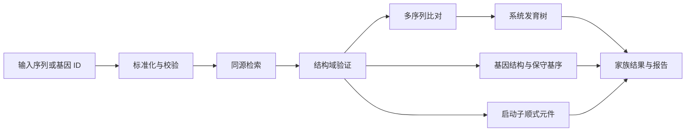

# Gene Family MCP

Gene Family MCP 是一个纯 API 的基因家族分析服务，供 Codex、Claude Desktop 等 MCP 客户端调用。仓库只有两个运行单元：

```text
MCP Client  <──stdio──>  mcp_server  <──HTTP/JSON──>  backend_service
                                                     ├── Django Ninja API
                                                     ├── django-q2 worker
                                                     ├── PlantCARE provider
                                                     └── 分析结果存储
```

`mcp_server` 处理 MCP 协议，`backend_service` 提供 Django Ninja API、django-q2 队列、分析程序适配器和 Artifact 存储。两者只通过 HTTP/JSON 通信。项目没有前端页面、Django 模板或 Admin 路由。

目前可以完成 FASTA 校验与标准化、MAFFT 多序列比对、FastTree 系统发育树和 PlantCARE 顺式作用元件预测。其中 `run_sequence_phylogeny` 已把 FASTA → MAFFT → FastTree 串成一个持久化工作流。BLAST/DIAMOND、HMMER、MEME、基因结构分析和 IQ-TREE 尚未接入，因此这还不是完整的基因家族鉴定流水线。

## 两个服务的职责

### `mcp_server`

MCP 协议适配层，供 Codex、Claude Desktop 等 MCP 客户端连接。

它负责：

- 注册 MCP tools。
- 将工具调用转换成后端 HTTP 请求。
- 返回结构化任务状态和结果。
- 隐藏后端内部数据库、队列和 provider 实现。

它不直接访问数据库、邮箱、PlantCARE，也不执行生信程序。

当前 tools：

| Tool | 说明 |
| --- | --- |
| `backend_health` | 检查后端 API 是否可用 |
| `get_capabilities` | 查看可用分析能力与队列后端 |
| `validate_fasta` | 上传、校验并标准化 DNA 或蛋白 FASTA |
| `align_sequences` | 使用 MAFFT 对规范化 FASTA Artifact 进行多序列比对 |
| `build_phylogenetic_tree` | 使用 FastTree 从 aligned FASTA 生成 Newick 树 |
| `run_sequence_phylogeny` | 一次启动 FASTA 校验、MAFFT 和 FastTree 持久化工作流 |
| `submit_cis_element_analysis` | 提交 DNA 启动子序列分析 |
| `get_job_status` | 查询业务任务状态与阶段 |
| `get_job_result` | 获取完成任务的结构化结果和产物 |
| `cancel_job` | 取消未结束任务 |

### `backend_service`

无前端页面的 API 与任务后端。

它负责：

- Django Ninja REST API。
- 输入校验、任务创建和状态查询。
- django-q2 worker 与任务执行。
- PlantCARE HTTP 提交、IMAP 邮件回收和附件保存。
- 后续本地生信工具与分析工作流。

当前 API：

| 方法 | 路径 | 说明 |
| --- | --- | --- |
| `GET` | `/api/core/health` | 后端健康检查 |
| `GET` | `/api/core/capabilities` | 分析能力与执行后端 |
| `POST` | `/api/inputs/fasta` | 上传并按内容去重保存 FASTA 输入 |
| `GET` | `/api/inputs/{input_artifact_id}/download` | 下载原始输入 |
| `POST` | `/api/jobs` | 创建通用分析任务 |
| `GET` | `/api/jobs/{job_id}` | 查询业务任务 |
| `GET` | `/api/jobs?status=queued&limit=50` | 按状态列出任务 |
| `GET` | `/api/jobs/{job_id}/events` | 查询状态与 provider 事件 |
| `GET` | `/api/jobs/{job_id}/result` | 获取结果与产物清单 |
| `POST` | `/api/jobs/{job_id}/cancel` | 取消任务 |
| `GET` | `/api/artifacts/{artifact_id}/download` | 下载产物 |
| `POST` | `/api/cis-elements/submit` | 提交顺式作用元件分析 |
| `GET` | `/api/cis-elements/tasks/{task_id}` | 查询状态或结果 |
| `GET` | `/api/docs` | OpenAPI 文档 |

仓库不再提供 HTML 预测页面和 Django Admin 路由。

## 目录结构

```text
gene-family-mcp/
├── mcp_server/
│   ├── server.py             # MCP tools 和 stdio 入口
│   ├── backend_client.py     # 后端 HTTP client
│   ├── settings.py           # MCP 侧配置
│   └── requirements.txt
├── backend_service/
│   ├── config/               # Django 配置与 API 路由
│   ├── core/                 # 健康检查等基础 API
│   ├── cis_elements/         # PlantCARE API 与 provider 原型
│   ├── jobs/                 # 业务任务、事件、产物与 q2 worker 入口
│   │   └── local_tools/      # MAFFT、FastTree 适配器与能力探测
│   ├── scripts/              # PlantCARE 独立调试脚本
│   ├── tests/fixtures/       # 测试输入
│   ├── manage.py
│   └── requirements.txt
├── docs/
│   ├── architecture.md       # 架构边界与演进方案
│   ├── operations.md         # 部署、备份与故障排查
│   └── plantcare-cli.md      # 独立脚本使用说明
└── README.md
```

## 快速开始

### 1. 创建虚拟环境

```powershell
python -m venv venv
.\venv\Scripts\python.exe -m pip install -r .\requirements-dev.txt
```

### 2. 配置后端

本地开发可以直接使用 SQLite。建议至少为 API 配置一个随机 Token，并让 MCP 使用同一个值：

```powershell
$env:BACKEND_API_TOKEN = "replace-with-a-random-token"
$env:GENE_FAMILY_BACKEND_TOKEN = $env:BACKEND_API_TOKEN
```

FASTA 校验不依赖外部程序。本机运行 MAFFT 和 FastTree 时，可按安装位置覆盖可执行文件名称或绝对路径：

```powershell
$env:MAFFT_EXECUTABLE = "mafft"
$env:FASTTREE_EXECUTABLE = "FastTree"
```

Docker 后端镜像已经安装 MAFFT 和 FastTree。本机是否可用以 `/api/core/capabilities` 的实时探测结果为准。

只有使用 PlantCARE 时才需要配置邮箱。应填写 IMAP 授权码，不要使用网页登录密码：

```powershell
$env:PLANTCARE_EMAIL = "your-email@qq.com"
$env:PLANTCARE_AUTH_CODE = "your-imap-auth-code"
$env:PLANTCARE_IMAP_HOST = "imap.qq.com"
```

### 3. 启动后端 API

```powershell
Set-Location .\backend_service
..\venv\Scripts\python.exe manage.py migrate
..\venv\Scripts\python.exe manage.py runserver
```

后端默认地址为 `http://127.0.0.1:8000/api`。

### 4. 启动 worker

在第二个终端执行：

```powershell
Set-Location .\backend_service
..\venv\Scripts\python.exe manage.py qcluster
```

### 5. 启动 MCP Server

在第三个终端回到仓库根目录：

```powershell
$env:GENE_FAMILY_BACKEND_URL = "http://127.0.0.1:8000/api"
.\venv\Scripts\python.exe -m mcp_server.server
```

MCP Server 默认使用 `stdio` transport。客户端配置时，命令应指向虚拟环境 Python，参数为 `-m mcp_server.server`，工作目录为仓库根目录。

提交工具支持可选 `idempotency_key`。相同分析类型和幂等键会返回原业务任务，不会重复提交 django-q2 或 PlantCARE。
相同幂等键如果携带不同参数会返回 `IDEMPOTENCY_CONFLICT`。后端还可以通过 `MAX_SEQUENCE_LENGTH` 和 `MAX_ACTIVE_JOBS` 限制输入与活跃任务容量。

## API 示例

以下示例假设后端已配置 `BACKEND_API_TOKEN`：

```powershell
$headers = @{ Authorization = "Bearer $env:BACKEND_API_TOKEN" }
```

使用通用任务接口提交分析：

```powershell
$body = @{
  analysis_type = "cis_elements"
  parameters = @{ sequence = "ACGTACGTNNACGT" }
} | ConvertTo-Json -Depth 3
Invoke-RestMethod `
  -Method Post `
  -Uri http://127.0.0.1:8000/api/jobs `
  -Headers $headers `
  -ContentType application/json `
  -Body $body
```

查询状态：

```powershell
Invoke-RestMethod `
  -Uri http://127.0.0.1:8000/api/jobs/<job_id> `
  -Headers $headers
```

FASTA 输入先创建 content-addressed Input Artifact，再提交异步任务：

```powershell
$input = Invoke-RestMethod `
  -Method Post `
  -Uri http://127.0.0.1:8000/api/inputs/fasta `
  -Headers $headers `
  -ContentType application/json `
  -Body (@{
    filename = "family.fa"
    content = ">gene1`nACGTACGT`n>gene2`nACGTTCGT`n>gene3`nACGGACGT`n"
  } | ConvertTo-Json)

$jobBody = @{
  analysis_type = "fasta_validation"
  parameters = @{
    input_artifact_id = $input.input_artifact_id
    alphabet = "auto"
  }
} | ConvertTo-Json -Depth 3

Invoke-RestMethod `
  -Method Post `
  -Uri http://127.0.0.1:8000/api/jobs `
  -Headers $headers `
  -ContentType application/json `
  -Body $jobBody
```

`fasta_validation` 检查 FASTA 结构、唯一标识符、DNA/蛋白字母表和容量限制。成功后返回记录数、总残基数、长度统计、检测字母表、DNA GC 比例，以及 `normalized_fasta` 和 `fasta_validation_summary` 两种 Artifact。

将 `normalized_fasta` 的 `artifact_id` 提交为 `multiple_sequence_alignment`，即可使用 MAFFT 生成 `aligned_fasta`。支持 `auto`、`linsi`、`ginsi` 和 `einsi` 策略；运行前应查询 `/api/core/capabilities`，因为本机安装模式下 MAFFT 是可选依赖，生产 Docker 镜像则已显式安装。

将 `aligned_fasta` 的 `artifact_id` 提交为 `phylogenetic_tree`，FastTree 会生成经过语法、叶数和安全标签校验的 Newick Artifact。DNA 支持 `auto/gtr/jc`，蛋白支持 `auto/jtt/lg/wag`；`auto` 分别选择 GTR 和 LG。

`run_sequence_phylogeny` 将上述三步组合为一个持久化父任务。父任务使用稳定 UUID，响应中的 `workflow_steps` 显示每个子任务；django-q2 Schedule 每分钟推进已完成依赖，因此 API/worker 重启后仍可继续。最终结果聚合记录数、字母表、比对长度、树叶数和 Newick Artifact。

使用刚才创建的 `$input` 可以直接启动完整工作流：

```powershell
$workflowBody = @{
  analysis_type = "sequence_phylogeny"
  parameters = @{
    input_artifact_id = $input.input_artifact_id
    alphabet = "dna"
    alignment_strategy = "auto"
    tree_model = "auto"
    threads = 2
  }
} | ConvertTo-Json -Depth 3

Invoke-RestMethod `
  -Method Post `
  -Uri http://127.0.0.1:8000/api/jobs `
  -Headers $headers `
  -ContentType application/json `
  -Body $workflowBody
```

对应的 MCP 调用是 `run_sequence_phylogeny(fasta, alphabet, alignment_strategy, tree_model, threads, filename, idempotency_key)`。调用后用返回的父 `job_id` 查询 `get_job_status` 和 `get_job_result`。

## 目标分析流程



当前已实现输入标准化、多序列比对、FastTree 建树和 PlantCARE；同源检索、结构域验证、基因结构、保守基序和完整报告仍是规划能力。后端负责执行和持久化已接入的流程，MCP 只提供稳定的工具接口。

## 下一阶段

- [x] 建立业务级 `AnalysisJob`、`Artifact` 和 `AnalysisEvent` 表。
- [x] 将 PlantCARE 长时间邮箱等待改为 django-q2 Schedule 周期检查。
- [x] 使用业务 UUID 和持久化状态解决任务查询问题。
- [x] 为 MCP 与后端通信增加认证、稳定错误码和超时策略。
- [x] 增加后端 Bearer Token、MCP 凭据转发、请求 ID 与幂等提交。
- [x] 增加单元测试、API 集成测试和 MCP 工具测试。
- [x] 增加 FASTA 输入 Artifact、校验、标准化与下载 API。
- [x] 安全解析 PlantCARE 归档与 `.tab`，生成结构化 JSON Artifact。
- [x] 接入 MAFFT 多序列比对 adapter、能力探测和 Artifact 溯源。
- [x] 接入 FastTree 系统发育 adapter、Newick 校验和 Artifact 溯源。
- [x] 建立可恢复的 FASTA → MAFFT → FastTree django-q2 工作流。
- [ ] 接入 BLAST/DIAMOND、HMMER 和高精度 IQ-TREE。

## 工程检查

Windows 开发环境可以运行：

```powershell
.\scripts\check.ps1
```

该命令执行 Django 系统检查、迁移漂移检查、后端测试、MCP 测试、Python 编译和 Git diff 检查。GitHub Actions 会在 push 和 pull request 时执行对应检查。

更详细的状态模型、数据模型和迁移计划见 [架构文档](docs/architecture.md)。
生产进程、Docker Compose、备份和故障排查见 [运行与部署手册](docs/operations.md)。

## 安全说明

- 不要提交邮箱授权码和 `.env`。
- MCP Server 不应接触 provider 密钥。
- 后端响应不应暴露邮箱正文、绝对路径或完整 traceback。
- 正式部署需要关闭 Django `DEBUG`、设置随机密钥，并配置非空的 `BACKEND_API_TOKEN`。

## License

项目尚未添加开源许可证。公开发布前需要明确许可证，并核对 PlantCARE 及后续生信工具和数据库的使用条款。
