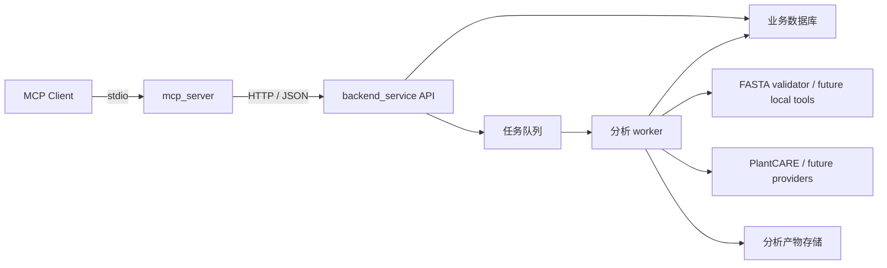
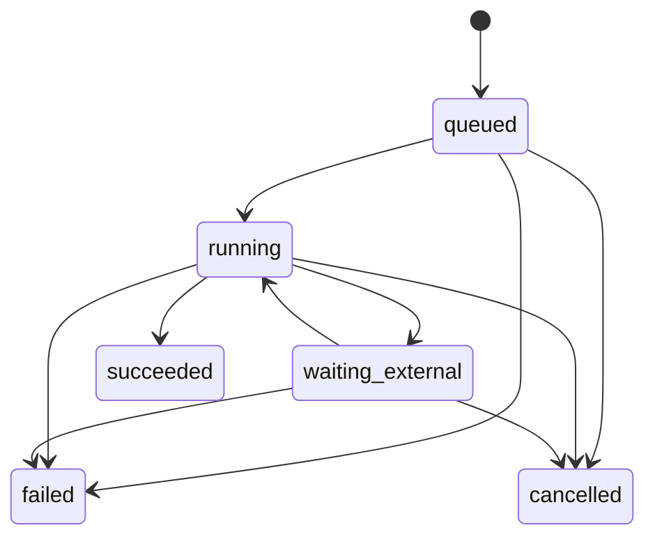
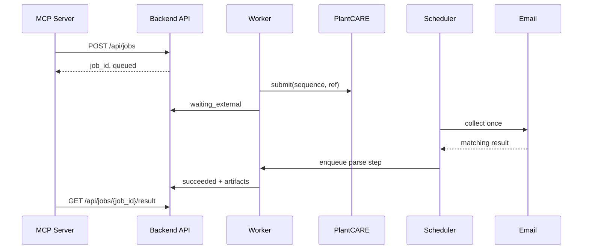

# Gene Family MCP 架构

## 1. 架构结论

系统固定分为两块：

1. `mcp_server`：MCP 协议服务。
2. `backend_service`：HTTP API、任务编排、分析执行和数据存储。

不建设独立前端。Django 只提供 API，不提供模板页面或 Admin 页面。



## 2. 为什么必须分开

MCP 是面向 Agent 的协议边界，后端是面向分析任务的业务边界。两者生命周期和扩展方式不同：

- MCP Server 应轻量、启动快、无状态。
- 后端需要持久化任务、运行 worker、管理密钥和调用分析工具。
- MCP 客户端不应知道 django-q2、数据库表或 PlantCARE 邮箱。
- 后端可以独立测试、部署、扩容，并服务其他 API 客户端。
- 将来替换 Django、队列或某个 provider 时，不需要改变 MCP tool schema。

## 3. `mcp_server` 边界

### 允许承担

- MCP tools/resources 注册。
- MCP 输入 schema 和简单参数规范化。
- 后端 API client。
- 后端错误到 MCP 错误的映射。
- 对 Agent 友好的工具说明和结构化输出。

### 禁止承担

- 直接导入 Django model。
- 直接读取 SQLite/PostgreSQL。
- 直接启动 django-q2 任务。
- 保存邮箱授权码。
- 直接轮询 IMAP 或调用 PlantCARE。
- 执行 BLAST、HMMER、MAFFT 等本地程序。
- 保存分析结果文件。

## 4. `backend_service` 边界

后端按内部职责继续分层：

```text
backend_service/
├── api              请求校验、响应 schema、认证
├── application      用例服务和工作流编排
├── domain           任务、序列、结果、产物领域模型
├── providers        PlantCARE 和本地生信工具适配器
├── jobs             队列、worker、scheduler
├── storage          数据库 repository 与 artifact store
└── scripts          独立诊断工具
```

当前 Django app 尚未完成上述内部重构，但新增业务能力必须按此边界实现，不能继续把 HTTP、IMAP、文件系统和工作流堆在同一个函数中。

## 5. 服务间 API 契约

MCP Server 只能依赖稳定的公开 API，不依赖后端内部队列表。

建议逐步统一为：

| 方法 | 路径 | 用途 |
| --- | --- | --- |
| `GET` | `/api/core/health` | 健康检查 |
| `GET` | `/api/capabilities` | 工具、数据库和版本能力 |
| `POST` | `/api/jobs` | 创建通用分析任务 |
| `POST` | `/api/inputs/fasta` | 创建内容寻址的 FASTA 输入 |
| `GET` | `/api/jobs/{job_id}` | 查询任务状态 |
| `POST` | `/api/jobs/{job_id}/cancel` | 取消任务 |
| `GET` | `/api/jobs/{job_id}/result` | 获取结构化结果 |
| `GET` | `/api/artifacts/{artifact_id}` | 下载分析产物 |

通用 `/api/jobs/*` 已实现；`/api/cis-elements/*` 作为兼容 API 保留，返回相同的业务 UUID。

## 6. 业务任务模型

已建立 `AnalysisJob`，django-q2 的内部 `Success`、`Failure`、`OrmQ` 不再充当公开任务模型：

| 字段 | 说明 |
| --- | --- |
| `id` | 对外稳定 UUID |
| `analysis_type` | 分析类型 |
| `status` | 业务状态 |
| `stage` | 当前工作流阶段 |
| `parameters` | 规范化参数 |
| `progress` | 可选进度 |
| `error_code` | 稳定错误码 |
| `error_message` | 对用户安全的错误说明 |
| `queue_task_id` | 可替换的内部队列 ID |
| `created_at/started_at/finished_at` | 生命周期时间 |

推荐状态机：



`waiting_external` 表示 PlantCARE 等外部任务已经提交但结果尚未返回。它不能占用普通分析 worker。

## 7. 分析产物模型

大文件、图片和压缩包不应塞入任务 JSON。已建立两类清单：

- `InputArtifact`：跨任务复用的不可变输入，以 `kind + sha256` 去重。
- `Artifact`：归属于某个任务的输出。

FASTA API 将原文保存在共享 Artifact 根目录的 `inputs/` 中，`AnalysisJob.parameters` 只保存 `input_artifact_id` 和字母表选项。worker 使用前核对文件大小和 SHA-256，避免损坏或被替换的输入进入分析。

输出 `Artifact` 包含：

- `id`
- `job_id`
- `kind`：FASTA、TSV、Newick、SVG、PNG、HTML report 等
- `uri`
- `sha256`
- `media_type`
- `size`
- `metadata`
- `created_at`

MCP 结果只返回结构化摘要和 artifact ID；需要时再读取对应资源。

## 8. PlantCARE 重构

现有 `run_prediction_task` 同时承担提交、等待、邮件解析和文件保存，需要拆成：

1. [x] `submit_prediction`：提交序列，返回外部 `ref`。
2. [x] `collect_results`：单次批量检查邮箱，不在内部 `sleep`。
3. [x] `PlantCareResultParser`：限制成员数量/大小，拒绝路径穿越与特殊成员，解析 `.tab` 并生成结构化 JSON。
4. [x] django-q2 Schedule：周期性寻找 `waiting_external` 任务并检查结果。



任务提交必须使用幂等键，防止 worker 重试时重复提交 PlantCARE。

## 9. MCP tool 设计

所有耗时工具立即返回 `job_id`。MCP 调用不能等待外部邮件或长时间命令完成。

建议 tools：

- `backend_health`
- `get_capabilities`
- `validate_fasta`（已实现）
- `submit_cis_element_analysis`
- `submit_gene_family_analysis`
- `get_job_status`
- `get_job_result`
- `cancel_job`

后端统一错误码：

- `INVALID_SEQUENCE`
- `INPUT_TOO_LARGE`
- `CAPABILITY_UNAVAILABLE`
- `PROVIDER_AUTH_FAILED`
- `PROVIDER_REJECTED`
- `PROVIDER_TIMEOUT`
- `TOOL_EXECUTION_FAILED`
- `ARTIFACT_NOT_FOUND`
- `JOB_NOT_FOUND`

## 10. 基因家族后端模块

| 模块 | 典型后端 | 主要产物 |
| --- | --- | --- |
| 输入标准化 | Python/Biopython | 标准 FASTA、校验报告 |
| 同源检索 | BLAST、DIAMOND | 候选成员 TSV |
| 结构域验证 | HMMER、InterProScan | domain 命中表 |
| 多序列比对 | MAFFT | aligned FASTA |
| 系统发育 | IQ-TREE、FastTree | Newick、支持率表 |
| 基因结构 | GFF/GTF parser | exon/intron 表与图 |
| 保守基序 | MEME Suite | motif 表与图 |
| 顺式元件 | PlantCARE provider | 元件表与汇总 |
| 报告 | Python 模板/绘图 | JSON、HTML、PDF |

各步骤通过 artifact ID 传递输入输出，以支持缓存、单步重跑和断点恢复。

## 11. 部署模型

### 本地单用户

- MCP Server：`stdio`。
- Backend API：localhost。
- SQLite 和本地 artifact 目录。
- 单 worker + scheduler。

### 远程或多用户

- MCP Server 可与客户端同机，通过 HTTPS 调用远程后端。
- Backend 使用 PostgreSQL、独立 worker 和对象存储。
- API 增加认证、速率限制和任务配额。
- 当前已支持后端 Bearer Token、请求 ID 和任务幂等键；速率限制与配额仍待实现。
- provider 密钥只存在于后端。

## 12. 当前风险

- FASTA 输入目前通过 JSON 文本上传；超大数据集后续应增加流式 multipart 或对象存储直传。
- 本地分析 adapter 尚未覆盖 MAFFT、BLAST/DIAMOND、HMMER 与 IQ-TREE。
- django-q2 worker 取消属于协作式取消；已经开始运行的外部程序后续需要进程级终止策略。
- 正式部署仍需要由运维提供随机 `SECRET_KEY`、API Token、TLS 与数据库、Artifact 联合备份。

## 13. 实施顺序

1. [x] 完成两服务目录和 HTTP 边界。
2. [x] 建立 `AnalysisJob`、`Artifact`、`AnalysisEvent`。
3. [x] 统一 `/api/jobs` 契约和 MCP tools。
4. [x] 完成 PlantCARE submitter、collector 和结构化 parser。
5. [x] 建立 django-q2 Schedule，移除 worker 内邮箱长轮询。
6. [x] 扩展测试、认证和稳定错误码。
7. [x] 建立 FASTA Input Artifact、校验与标准化任务。
8. [x] 建立 MAFFT adapter、运行时能力探测和 Artifact 串联。
9. [x] 建立 FastTree adapter 与受校验的 Newick 输出。
10. [ ] 接入完整基因家族分析工具链。

## 14. 架构验收标准

- MCP Server 不导入任何 Django 模块。
- MCP Server 不读取后端数据库或 provider 密钥。
- 后端没有 HTML 页面和模板路由。
- 未知任务返回明确的 404/`JOB_NOT_FOUND`。
- 外部等待不占用普通 worker。
- 后端重启后任务和结果仍可查询。
- 所有产物包含校验和、类型、来源和工具版本。
- 单元测试无需真实网络或邮箱即可运行。
