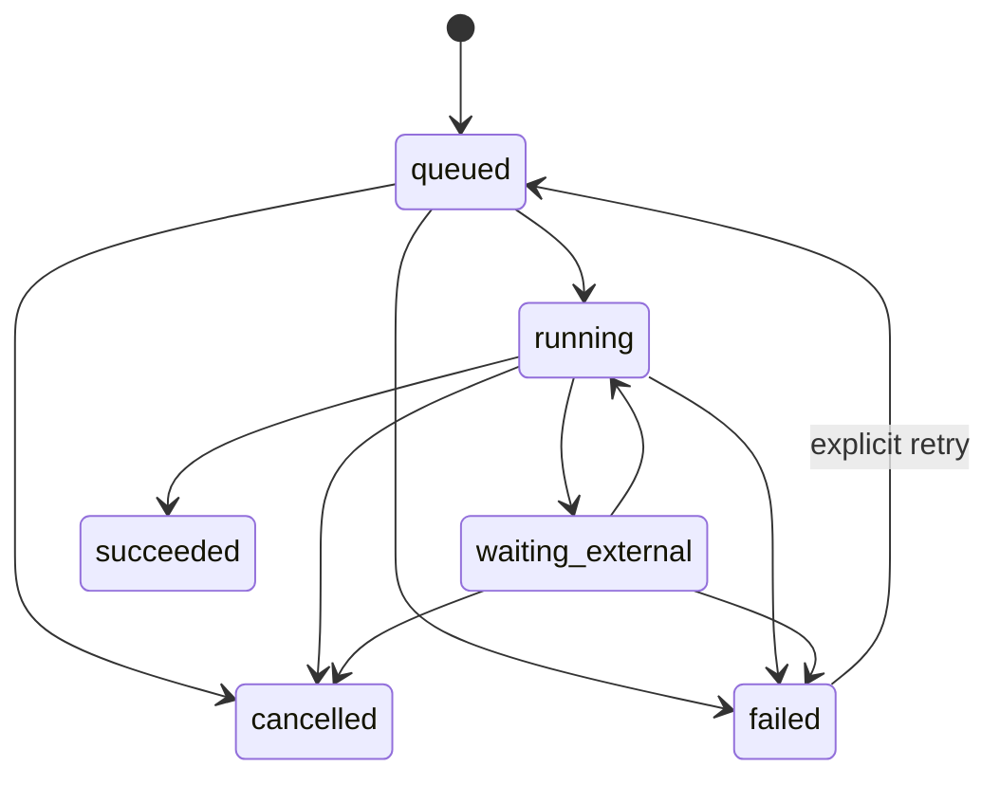
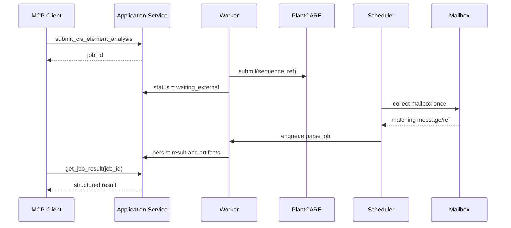

# Gene Family MCP 架构设计与现状评估

## 1. 文档目的

本文档重新定义仓库的系统边界：它不是单一 PlantCARE 自动化脚本，而是一个面向 MCP 客户端的基因家族分析平台。现有代码作为可迁移资产保留，但目标架构不应继续围绕 Django view、django-q2 内部表或邮箱轮询组织。

## 2. 现状结论

### 2.1 可复用资产

- PlantCARE multipart 请求构造逻辑。
- 任务随机 `ref` 与邮件匹配思路。
- MIME 正文解析和附件保存逻辑。
- Django Ninja API、SQLite 和 django-q2 的最小运行骨架。
- 已成功下载过的 PlantCARE 结果样例，可用于后续解析器 fixture。

### 2.2 主要结构性问题

#### 任务生命周期不属于业务层

当前 API 直接读取 `Success`、`Failure` 和 `OrmQ`。这让对外状态语义依赖队列库内部实现，也无法表示 `submitted_to_provider`、`waiting_external_result`、`parsing` 等业务阶段。

#### 队列超时与外部等待不匹配

worker 超时为 90 秒，PlantCARE 邮件轮询最长为 1800 秒。任务可能被杀死和重复投递，进而重复提交远程任务。现有数据库中已经出现大量重试记录。

#### worker 承担长轮询

每个分析任务都占用一个 worker 保持 IMAP 连接并 `sleep`。当 worker 数量为 2 时，两条等待邮件的任务即可耗尽全部执行容量。

#### 状态查询不可靠

django-q2 的 `OrmQ.payload` 是编码后的序列化内容，无法用 `payload__contains=task_id` 稳定查询。不存在的 ID 目前也会被返回为 `processing`。

#### 缺少业务实体和溯源

目前没有持久化的分析任务、输入、参数、产物、事件和 provider 请求记录。结果仅作为队列返回值和本地文件路径存在。

#### 领域逻辑与基础设施耦合

PlantCARE HTTP、IMAP、文件系统、Django settings 和任务主流程集中在一个模块中，难以模拟、测试或替换。

#### 安全边界不足

- 邮件附件名未规范化，存在目录穿越风险。
- 序列只有非空校验。
- 没有输入长度、任务配额和并发限制。
- Django 使用开发密钥和 `DEBUG=True`。
- 失败结果可能直接向用户暴露本地路径和 traceback。

### 2.3 组件处置建议

| 现有组件 | 决策 | 原因 |
| --- | --- | --- |
| PlantCARE 请求与邮件解析 | 拆分后保留 | 已验证外部调用链，是顺式元件模块的可用基础 |
| Django ORM | 保留 | 适合承载任务、产物、事件及管理后台 |
| Django Ninja | 作为可选 HTTP 接口保留 | 便于网页和非 MCP 客户端调用，但不再承载领域逻辑 |
| django-q2 | 暂时保留、通过接口隔离 | 原型可继续运行；后续是否替换不应影响应用层 |
| SQLite | 仅限本地开发 | 多 worker、并发写入和生产可靠性有限 |
| `test.py` / `plantcare_submit.py` | 迁移为 CLI 与测试 fixture | 避免与正式 provider 维持两套重复实现 |
| 当前预测网页 | 降级为开发演示界面 | 不是 MCP 核心能力，可在稳定 API 之上继续维护 |
| `core` 示例任务 | 删除或改为真正的系统诊断 | 当前示例不属于基因家族业务 |

## 3. 推荐的系统边界

采用模块化单体，在一个 Python 项目内保持四个清晰边界。

### 3.1 领域层

不依赖 Django、MCP SDK、队列或具体工具，包含：

- `SequenceRecord`：序列 ID、字母表、类型、长度、校验结果。
- `GeneFamilyDataset`：成员、物种、来源和输入产物。
- `AnalysisJob`：业务级任务及状态机。
- `Artifact`：文件产物的类型、位置、校验和、MIME 和大小。
- `AnalysisResult`：结构化结果摘要与产物引用。
- `Provenance`：工具、版本、参数、数据库和运行环境。

### 3.2 应用层

实现用例，不处理协议细节：

- 校验/导入序列。
- 创建分析任务。
- 编排单步或多步家族工作流。
- 查询、取消、重试任务。
- 获取结果和产物。
- 根据 provider 能力选择具体实现。

### 3.3 接口层

- MCP：tools、resources 和协议错误映射。
- HTTP：浏览器、自动化脚本及运维接口。
- CLI：开发、批处理和故障排查。

接口层不得直接操作队列表，也不得包含生信分析实现。

### 3.4 基础设施层

- provider：PlantCARE、BLAST、HMMER、MAFFT、IQ-TREE/FastTree、MEME 等。
- job backend：worker、scheduler 和队列实现。
- persistence：Django ORM repository。
- artifact store：本地目录或对象存储。
- process runner：受限地执行本地生信命令。

## 4. 任务状态模型

建议使用显式状态机：



状态含义：

- `queued`：已持久化，等待 worker。
- `running`：正在执行本地步骤或提交远程请求。
- `waiting_external`：远程任务已提交，等待邮件或远程状态变化，不占用普通 worker。
- `succeeded`：结果完成并已持久化。
- `failed`：终止失败，包含稳定错误码和可诊断信息。
- `cancelled`：用户取消，不再调度后续步骤。

任务需要保存当前 `stage` 和可选 `progress`，例如 `homology_search`、`domain_validation`、`alignment`、`phylogeny`、`cis_elements`、`reporting`。

## 5. 核心数据模型

### AnalysisJob

| 字段 | 说明 |
| --- | --- |
| `id` | 稳定 UUID，作为 MCP `job_id` |
| `analysis_type` | `cis_elements`、`gene_family_full` 等 |
| `status` | 业务状态 |
| `stage` | 当前工作流阶段 |
| `input_manifest` | 输入 artifact 引用和摘要 |
| `parameters` | 规范化后的参数 JSON |
| `progress` | 0–100，可为空 |
| `error_code` | 稳定机器可读错误码 |
| `error_message` | 对用户安全的错误信息 |
| `created_at/started_at/finished_at` | 生命周期时间 |
| `attempt` | 显式重试次数 |

### Artifact

| 字段 | 说明 |
| --- | --- |
| `id` | 稳定 UUID |
| `job_id` | 所属任务 |
| `kind` | `input_fasta`、`alignment`、`tree_newick`、`table_tsv`、`figure_svg`、`report` 等 |
| `uri` | 存储位置，不直接信任用户路径 |
| `sha256` | 内容校验和 |
| `media_type` | MIME 类型 |
| `size` | 文件大小 |
| `metadata` | 行列数、序列数、图片尺寸等 |

### AnalysisEvent

追加式事件日志，记录状态变化、provider 请求、重试和解析结果。该表用于审计与排障，不替代任务当前状态。

## 6. PlantCARE provider 重构

PlantCARE 应拆成三个可独立测试的组件：

1. `PlantCareSubmitter`：提交序列并返回外部 `ref`。
2. `PlantCareInboxCollector`：一次性读取新邮件，提取候选消息，不在内部循环睡眠。
3. `PlantCareResultParser`：安全解包附件，将 `.tab` 和 HTML 转为结构化结果。

推荐流程：



必须使用幂等键，确保任务重试时不会再次提交相同的 PlantCARE 请求。

## 7. MCP 设计约束

### 小型稳定 schema

工具输入只接收业务参数，不暴露本地绝对路径、django-q2 参数或邮箱实现细节。

### 长任务异步化

提交工具快速返回：

```json
{
  "job_id": "uuid",
  "status": "queued",
  "status_resource": "gene-family://jobs/uuid"
}
```

### 错误可判定

建议错误码至少包括：

- `INVALID_SEQUENCE`
- `INPUT_TOO_LARGE`
- `CAPABILITY_UNAVAILABLE`
- `PROVIDER_AUTH_FAILED`
- `PROVIDER_REJECTED`
- `PROVIDER_TIMEOUT`
- `TOOL_EXECUTION_FAILED`
- `ARTIFACT_NOT_FOUND`
- `JOB_NOT_FOUND`

### capabilities 可发现

不同部署可能没有安装相同的数据库和生信程序。客户端应能查询当前可用 provider、版本、支持的输入类型和限制。

## 8. 基因家族工作流的模块划分

| 模块 | 输入 | 主要输出 | 候选后端 |
| --- | --- | --- | --- |
| 序列标准化 | FASTA/ID | 标准 FASTA、校验报告 | Python/Biopython |
| 同源检索 | 种子序列、数据库 | 候选成员表 | BLAST、DIAMOND |
| 结构域验证 | 候选蛋白 | domain 命中表 | HMMER、InterProScan |
| 多序列比对 | 家族蛋白 | aligned FASTA | MAFFT |
| 系统发育 | alignment | Newick、支持率表 | IQ-TREE、FastTree |
| 基因结构 | GFF/GTF、成员 ID | exon/intron 表与图 | Python parser |
| 保守基序 | 家族蛋白 | motif 表与图 | MEME Suite |
| 顺式元件 | 启动子序列 | 元件表与汇总 | PlantCARE provider |
| 共线性 | 基因组与注释 | synteny pairs | MCScanX 等 |
| 报告 | 全部结果 | HTML/PDF/JSON manifest | Python 模板与绘图 |

每个步骤输出 artifact，后续步骤只引用 artifact ID。这样单步可以重跑，完整工作流也能断点恢复。

## 9. 安全与运行约束

- 所有上传文件和附件都使用服务端生成的文件名。
- 解析归档前验证成员路径、数量、单文件大小和总解压大小。
- 本地命令使用参数数组调用，禁止拼接 shell 字符串。
- 限制序列条数、单序列长度、总碱基/氨基酸数和并发任务数。
- worker 在独立工作目录运行，并对 CPU、内存、执行时间和磁盘配额设限。
- MCP/HTTP 响应不暴露授权码、邮箱内容、绝对路径或完整 traceback。
- 结果目录按任务隔离，产物下载经过 artifact repository 校验。

## 10. 部署建议

### 本地单用户

- MCP `stdio` transport。
- SQLite。
- 本地 artifact 目录。
- 单 worker。

### 多用户或远程部署

- MCP Streamable HTTP，并配置认证与反向代理。
- PostgreSQL。
- 独立 worker/scheduler。
- 对象存储或受管共享存储。
- 结构化日志、指标和任务告警。

不要让 Web/MCP 进程直接执行耗时生信命令。

## 11. 迁移顺序

### Phase 1：打基础

- 建立 `pyproject.toml` 和 `src/gene_family_mcp`。
- 定义领域模型、repository 接口和配置模型。
- 实现 FASTA 校验与 MCP Server 最小闭环。
- 为现有 PlantCARE 样例建立 fixtures。

### Phase 2：迁移 PlantCARE

- 拆分 submitter、collector、parser。
- 新建业务任务表与 artifact 表。
- 将邮箱检查改为 scheduler 周期任务。
- API/MCP 只读取业务任务状态。

### Phase 3：家族核心流程

- 接入 BLAST/DIAMOND、HMMER、MAFFT、IQ-TREE。
- 实现工作流 DAG、缓存、断点恢复和产物 manifest。

### Phase 4：扩展分析与报告

- 基因结构、motif、顺式元件、共线性和表达分析。
- 统一绘图和 HTML/PDF 报告。

### Phase 5：生产化

- PostgreSQL、认证、配额、对象存储和可观测性。
- 完成安全审计、压力测试和发布流程。

## 12. 当前不建议做的事情

- 不要把每个底层命令都直接暴露为一个高自由度 MCP tool。
- 不要把 MCP server 与 Django view 写在同一模块。
- 不要使用队列库内部表作为用户可见任务模型。
- 不要在 worker 内通过长时间 `sleep` 等待邮件。
- 不要把大结果、图片或压缩包直接保存进任务 JSON。
- 不要在缺少输入、版本和数据库记录的情况下生成“最终结论”。

## 13. 架构验收标准

进入功能扩展前，基础架构至少应满足：

- MCP、HTTP 和 CLI 对同一输入产生一致任务。
- 服务重启后任务和结果仍可查询。
- 未知 `job_id` 明确返回 `JOB_NOT_FOUND`。
- 外部等待不占用普通分析 worker。
- 同一任务重试不会重复提交远程分析。
- 所有产物有校验和、类型、来源和工具版本。
- 单元测试无需真实网络和邮箱即可运行。
- 失败响应不泄露密钥、本地绝对路径和 traceback。
